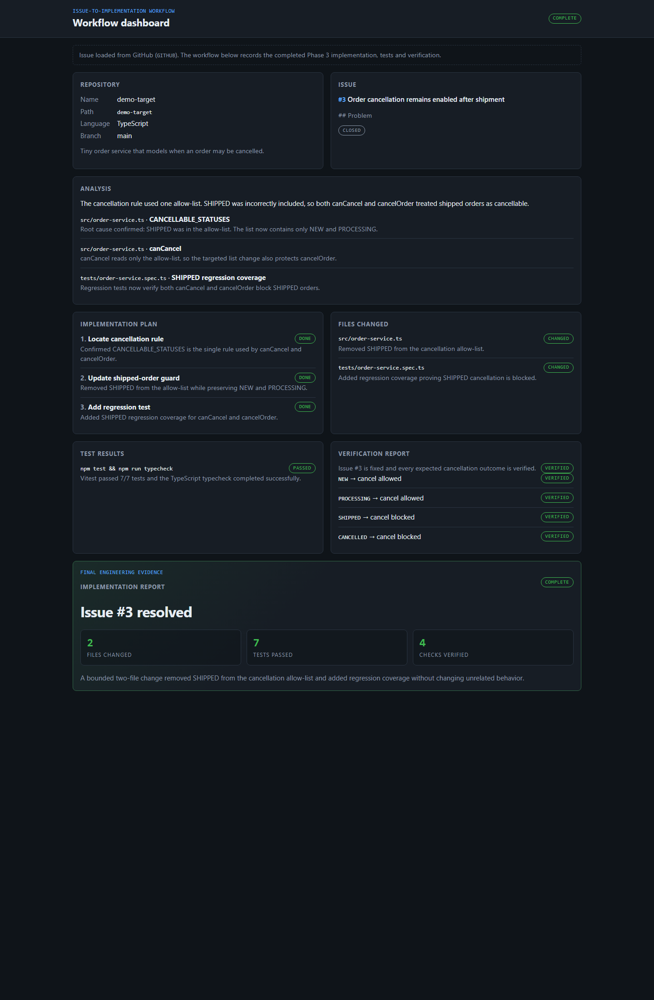

# Claude Code in Action: Issue-to-Implementation Workflow

A small portfolio project that demonstrates a complete, bounded maintenance loop:

```
GitHub Issue -> Codebase Analysis -> Implementation Plan -> Targeted Code Change
             -> Focused Tests -> Verification -> Implementation Report
```

**Status: complete.** The backend reads GitHub Issue #3, the demo codebase contains the real verified fix, and the Angular dashboard presents the implementation evidence in one place.



## What this project proves

- Real GitHub issue ingestion with native `fetch`
- Codebase exploration before editing
- A small implementation plan before the fix
- A bounded two-file code change
- Regression tests for the reported defect
- Typecheck, backend/frontend regression checks and CI
- Verification of expected behavior
- A typed implementation report for recruiter-readable evidence

## Architecture

| Area | Stack | Role |
| --- | --- | --- |
| `frontend/` | Angular, TypeScript, SCSS | Displays repository context, issue, analysis, plan, changes, tests, verification and implementation report. |
| `backend/` | Node.js, Express, TypeScript | Reads Issue #3 from GitHub and exposes the typed workflow summary. |
| `demo-target/` | TypeScript, Vitest | Small order service changed by the issue workflow. |

See [docs/architecture.md](docs/architecture.md) for the Mermaid diagrams.

## Issue #3 result

Root cause:

```ts
const CANCELLABLE_STATUSES = ['NEW', 'PROCESSING', 'SHIPPED'];
```

`SHIPPED` was removed. Regression coverage now verifies both `canCancel` and `cancelOrder` reject shipped orders.

| Status | Cancel |
| --- | --- |
| `NEW` | allowed |
| `PROCESSING` | allowed |
| `SHIPPED` | blocked |
| `CANCELLED` | blocked |

Implementation evidence shown by the dashboard:

- **2** functional files changed
- **7/7** demo-target tests passed
- **4/4** cancellation outcomes verified
- TypeScript typecheck passed
- Backend and frontend regression suites passed
- GitHub Actions passed

## GitHub ingestion

The backend reads `Seldir193/claude-code-issue-workflow#3`. When the API succeeds, `source` is `GITHUB`. If GitHub is unavailable, fallback issue metadata is returned with `source: SEED` and an `ingestionError`; the completed implementation record remains visible.

Automated tests inject fake fetch/load functions, so tests do not depend on the live network.

## Run locally

Requires Node.js 24 and npm.

```bash
# Terminal 1
cd backend
npm install
npm run dev

# Terminal 2
cd frontend
npm install
npm start
```

Open `http://localhost:4200`.

Full verification:

```bash
cd backend
npm run lint
npm test
npm run build

cd ../frontend
npm test -- --watch=false
npm run build

cd ../demo-target
npm test
npm run typecheck

cd ..
docker compose up --build
```

CI runs backend lint/test/build, frontend test/build, and demo-target typecheck/tests.

## Scope and non-goals

This repository is deliberately bounded. It does not implement arbitrary repository execution, authentication, a database, queues, Kubernetes, subscriptions or multi-agent orchestration.

See [docs/learning-map.md](docs/learning-map.md) for how each phase maps to the Claude Code / issue-driven engineering skills demonstrated here.
