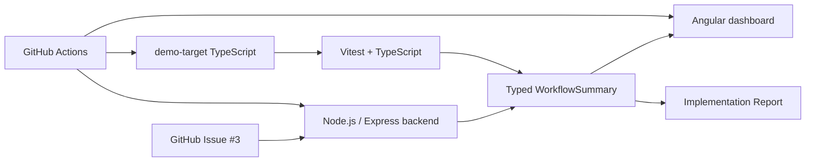
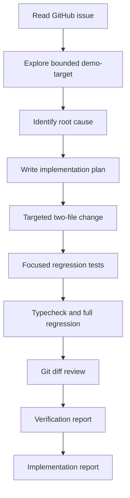

# Architecture

The project is intentionally small. It demonstrates one bounded issue moving from external context to a verified code change without turning into a general-purpose code execution platform.

## Issue-to-implementation flow

## Boundaries

- The GitHub integration reads one configured issue.
- The demo target is a local, controlled TypeScript codebase.
- Tests do not call the live GitHub API.
- There is no arbitrary repository execution, authentication, database, queue, multi-agent orchestration or production deployment layer.
